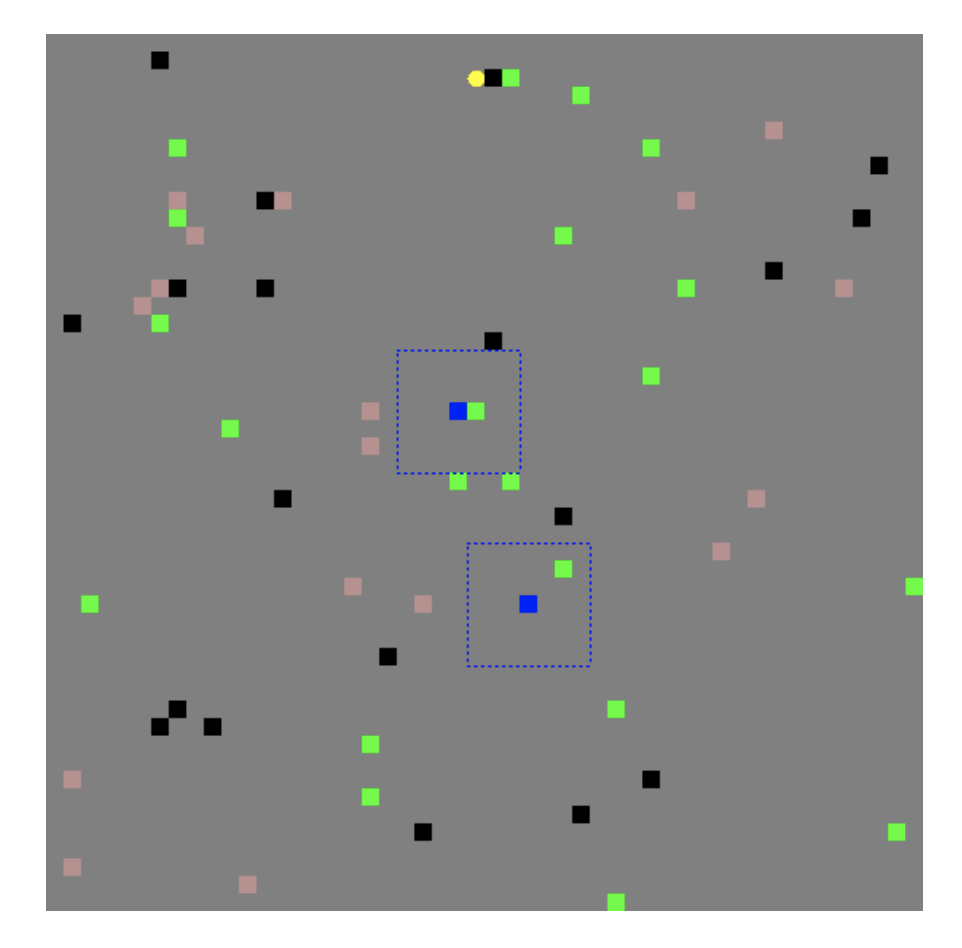
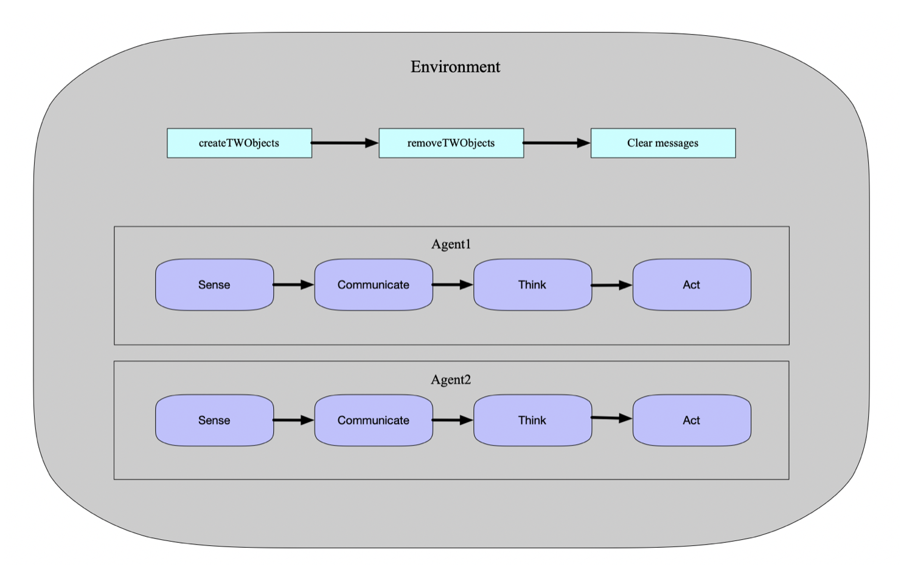

## Tileworld-MAS

>In the project, we designed three plans to solve the problem, and revised communication and memory management modules to help our agents achieve better performance. What’s more, we also designed some strategies such as searching for fuel-station, refueling, and estimation of lifetime, which turned out to have crucial influence on the performance. Finally, we tested our system and analyzed the pros and cons. In the future, heuristic algorithm could be combined with GNP/RL to achieve better performance.
>
>

>  
>  
>

>
>**Team members**: [Skye@NEU/NTU](https://github.com/RoyalSkye), Zhicheng@PKU/NTU

### Requirements

- Install `Java JDK` and the JDK version should be `1.8`.
- Install the `Java3D` library (version 1.5). You can download the library file [here](https://www.oracle.com/technetwork/java/javase/tech/index-jsp-138252.html) and install the library [following](https://download.java.net/media/java3d/builds/release/1.5.1/README-download.html).
- Download the `MASON_14.jar` file and use this jar file as the external library for compiling and running.

### Result

Table 2 shows the experiment results of our agent plans. We run 10 experiments for each configuration in Table 1. For each experiment, we used a different random seed. We find that Plan A has a better performance in Configuration 2, while Plan C has a better performance in Configuration 1. In environment configuration 2, there’s a case that one agent may find the fuel-station in its final search area. However, the remained fuel-level of another agent isn’t enough to arrive at the fuel- station. In this case, the overall performance will decrease dramatically. We have calculated it in the result and marked it as (1) in the Table 2, where the number represents the occurrences of this special case in 10 experiments.

|            |  Env1   |  Env2   |
| :--------: | :-----: | :-----: |
|    Size    | 50 * 50 | 80 * 80 |
|    *μ*     |   0.2   |    2    |
|    *σ*     |  0.05   |   0.5   |
|  Lifetime  |   100   |   30    |
| Fuel-level |   500   |   500   |
|   Steps    |  5000   |  5000   |

Table 1: Environment configurations for testing.

| Agent plan | Env Setting |    Agent 1    |  Agent 2  |  Overall  |
| :--------: | :---------: | :-----------: | :-------: | :-------: |
|     A      |    Env1     |     147.8     |   147.6   |   295.4   |
|     A      |    Env2     | **172.6 (1)** | **182.7** | **355.3** |
|     B      |    Env1     |     114.6     |   87.3    |   201.9   |
|     B      |    Env2     |     121.4     |   118.4   |   239.8   |
|     C      |    Env1     |   **160.8**   | **159.5** | **320.3** |
|     C      |    Env2     | 164.9 **(1)** |   180.6   |   345.5   |

Table 2: The average score for each environment configuration in 10 tests.

